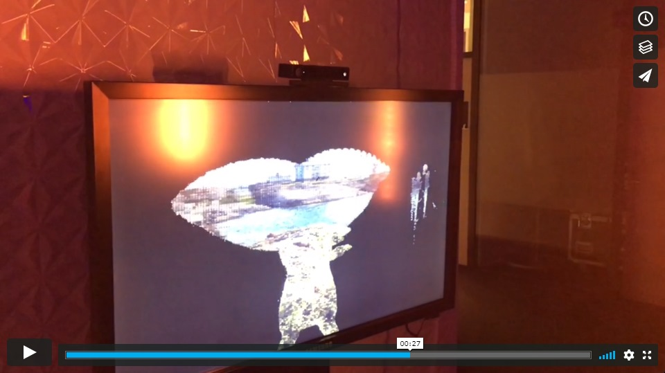
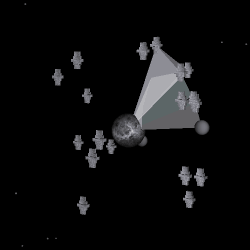

# Generative art projects
{:.no_toc}

* Will be replaced with the ToC
{:toc}

## [Sunflower](./PSunflower) Sprint 2018
[Phyllotaxis](https://en.wikipedia.org/wiki/Phyllotaxis) with Processing.

## [Triangles](./PTriangles/) Spring 2018
  A collage on satellite imagery from São Paulo, more specifically from the [west access to city](https://www.google.se/maps/@-23.5254695,-46.7478157,14.44z).
  
## [Queen](./pySpotifyAlbumFeatures/) Autumn 2017
  A visualization of all Queen albums according to danceability and other measures. Data from Spotify API.
  
  

## [Flashlight](./p5jsFlashlight/) Sprint 2017
  Interactive sketch.
  
  
  
## [Interactive gallery](./mixInteractiveGallery)
  Interactive gallery is a photography exhibition in which the audience is invited to explore the images by moving their hands, as if shedding light on a wall using a flashlight. The live installation used the Kinect device. A browser version is available, which works with mouse positions only.
  
  

## [Orbital Challenge: coding challenge flerting with 3D visualization.](./orbitalChallenge/)
This sketch is the 3D visualization of a routing challenge proposed by Reaktor.

# Technical notes
 * I organized the source code so that there is one generative art project per folder. 
 * Projects starting with P are [Processing](processing.org) sketches; pyXXX are Python-based, otherwise a combination of techniques & languages.
 * In Processing sketches, additional data (images, audio, video, JSON etc) used by the sketches in always in the `/data` folder of each Processing sketch.
 * If the sketch generates some kind of output, it will be placed in `/out` folder. The source code includes one output as example.
