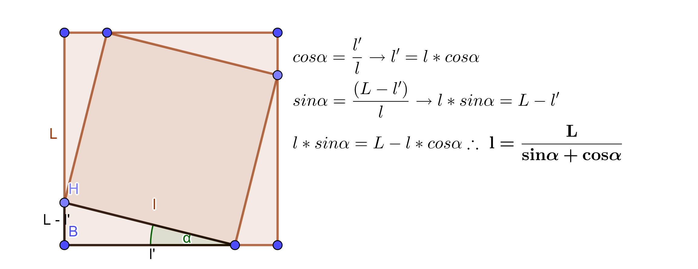
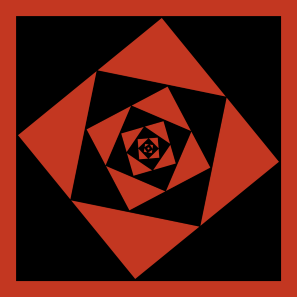
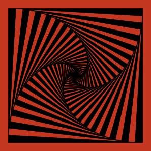

# Vertigo III
> Part of the [Vertigo series](././)  

  

In Vertigo III the effect of an infinite staircase is created by drawing a sequence of squares of decreasing size, with a small rotation in each iteration.    


For the next reactangle to fit into the previous one, I calculated the size `l` from the previous rectangle `L` according to the rotation angle as follows:  
  

A larger &alpha; generates less detailed image:  

&alpha;|Result|&alpha;|Result
---|---|---|---|
0.89||0.10|
0.06||0.03|


I use the same formula in code, but I can simply reasign the new value to the same variable:
```javascript
  rect(0, 0, s, s );
  s = s / (sin(a) + cos(a));
```


To make the drawing "pop" and give a 3D illusion, the color of the rectangles are alternated with modulus function.
```javascript
  if(frameCount % 2 == 0)
    fill(mainColor);
  else fill(0);
```

# OpenProcessing
Available [here](https://www.openprocessing.org/sketch/544091).
